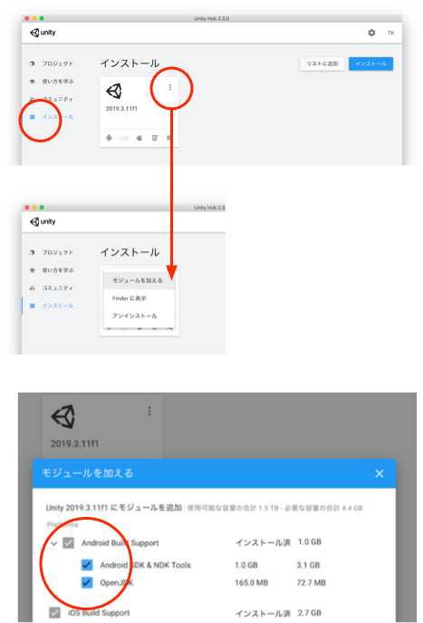
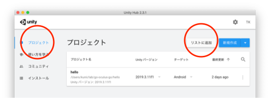
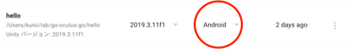

# go-oculus-go
UnityでOculus Go/Quest用のVRアプリを作成する。各アプリのプロジェクトはリポジトリ内でサブフォルダに分けて配置する。
|サブフォルダ名|説明|
|-|-|
|hello|空間にキューブを浮かべているのをOculus Go/Questで見られるようにする|
|dance|人間のモデルを表示させダンスさせる|
|room|室内に物体と人間のモデルを配置し動作させる|

# 必要なもの
- Oculus Go/Quest
- MacまたはWindowsマシン
- インターネット接続環境
- Unity
- Blender（3Dモデルを作成・修正するなら利用、既存のものをそのまま使うなら不要）

## Oculus Go/Quest
Oculus Go/Questは、OSがAndroidであるコンピュータにVRゴーグルが1体となったデバイス。VRゴーグル、アプリの実行環境として利用する。
| 機種 | 特徴 |
| - | - |
| Go | ゴーグルの回転角をxyzの3軸について検出できる |
| Quest | Goの回転に加え、ゴーグルの平行移動をxyzの3軸について検出できる |

これがないと始まらない。Questが望ましいがGoでも可。
- [Oculus Go/Quest開発者サイト](https://developer.oculus.com)
## MacまたはWindowsマシン、インターネット接続環境、Unity、Blender
アプリの開発自体はMacまたはWindowsマシンでUnityという開発ツールを使って行う。
- [Unity](https://unity.com/ja)

BlenderはこのUnityで扱う3Dモデルを作成するために使用する。
- [Blender](https://www.blender.org)

Unity、Blenderはインターネットからのダウンロードとなるのでインターネット接続環境が必要。
# 準備
- MacまたはWindowsマシンにUnityをインストールしておく
- アプリ開発にあたりOculus Go/Questは開発者モードにしておく
- MacまたはWindowsマシンで開発したアプリをOculus Go/Questに転送させるため、両者間をUSBケーブルで繋ぐ

注意）Windowsマシンからの転送にはOculus ADB Driversも必要となる
## Unityをインストールしておく
上述のUnityサイトからUnityをダウンロードしインストールする。 
この際にアプリを動かしたい環境（プラットフォーム）を尋ねられるので、Android環境を含めること。
### すでにUnityをインストール済みでAndroidプラットフォーム未対応の場合
Unity Hubを立ち上げてモジュールを追加する。 
Unity Hubホーム画面のインストールタブを選び、インストールされているUnityのメニューから「モジュールを加える」を選び、Android Build SupportおよびAndroid SDK & NDK Tools、OpenJDKにチェックを入れてインストールする。

## Oculus Go/Questを開発者モードにする
- 上述のOculus Go/Quest開発者サイトで開発者登録する
- スマートフォンまたはタブレットにOculusアプリをインストールする
- 使用するOculus Go/QuestをOculusアプリに登録する
- Oculusアプリで登録したOculus Go/Quest項目をタップすると設定に進めるので開発者モードを設定する

[Oculusアプリ（iOS）](https://apps.apple.com/us/app/oculus/id1366478176)

[Oculusアプリ（Android）](https://play.google.com/store/apps/details?id=com.oculus.twilight&hl=ja)

[GoogleでOculus Go/Questの開発者モードを設定する方法を検索](https://www.google.com/search?client=safari&rls=en&q=Oculus+Go/Quest+%E9%96%8B%E7%99%BA%E8%80%85%E3%83%A2%E3%83%BC%E3%83%89&ie=UTF-8&oe=UTF-8)

## Windowsマシンからの転送にはOculus ADB DriversをWindowsマシンにインストールする
上述のOculus Go/Quest開発者サイトにOculus ADB Driversをダウンロードするページがあるので、ダウンロードしインストールする。後はUnityが自動で使ってくれる。
- [Oculus ADB Drivers](https://developer.oculus.com/downloads/package/oculus-adb-drivers/)
## MacまたはWindowsマシンとOculus Go/QuestをUSBケーブルで繋ぐ
Oculus Go/Questの電源を入れてUSBケーブルを繋ぐ。 
ちなみに、初めて繋いだ時はOculus Go/Quest側でMacまたはWindowsマシンとの接続を許可するか聞かれるので許可すること。
# Unityでプロジェクトの登録
開発するOculus Go/QuestアプリのプロジェクトをUnityHubに登録しプロジェクトを開く。 
例えば、このリポジトリのhelloプロジェクトを登録するなら、UnityHubのプロジェクト画面で、リストに追加ボタンを押し、go-oculus-go/helloフォルダを指定すれば次のように登録される。

この項目をクリックすればhelloプロジェクトが開かれる。 
クリックの前にターゲットをAndroidにしておけば、プロジェクト画面が出た後で、File>Build Settings…メニューで出てくるBuild Settings画面でAndroidを選択しSwitch Platformボタンを押す手間が省ける。

# 実行
起動したプロジェクトでFile>Build and Runメニューを選ぶと、アプリがビルドされ、繋がれたOculus Go/Questに転送、実行される。

作業でつまったら、以下のWikiも参照してみる。

[Oculus-Go・Questで動くアプリの作成](https://github.com/Takahiro-Kunii/go-oculus-go/wiki/Oculus-Go・Questで動くアプリの作成)
